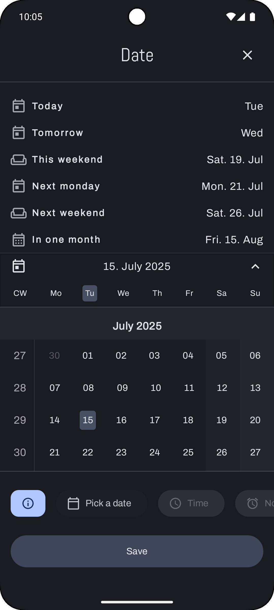

# 📝 Plan Me

## Your Advanced, Offline-First Task Planner for Structured Productivity.
## Dein fortschrittlicher, Offline-First Aufgabenplaner für strukturierte Produktivität.

---

## 📚 Table of Contents / Inhaltsverzeichnis

| 🇬🇧 English | 🇩🇪 Deutsch |
|------------|-------------|
| [App Previews](#app-previews) | [App-Vorschauen](#app-vorschauen) |
| [Features](#features) | [Funktionen](#funktionen) |
| [Technology Stack & Architectural Principles](#technology-stack--architectural-principles) | [Technologie-Stack & Architekturprinzipien](#technologie-stack--architekturprinzipien-de) |
| [Architectural Highlights](#architectural-highlights) | [Architektonische Highlights](#architektonische-highlights-de) |
| [Development](#development) | [Entwicklung](#entwicklung-de) |
| [Roadmap & Future Enhancements](#roadmap--future-enhancements) | [Roadmap & Zukünftige Erweiterungen](#roadmap--zukünftige-erweiterungen-de) |
| [Contributing](#contributing) | [Mitwirken](#mitwirken-de) |
| [License](#license) | [Lizenz](#lizenz-de) |
| [Contact](#contact) | [Kontakt](#kontakt-de) |

---

## 📸 App Previews / App-Vorschauen

A showcase of Plan Me's clean and feature-rich interface.
Eine Demonstration der sauberen und funktionsreichen Oberfläche von Plan Me.

### Animated Previews / Animierte Vorschauen
| Board & List View Toggle | Smooth Scrolling Calendar |
|---|---|
|  |  |

### Screenshots
| Feature / Screen | Preview |
|---|---|
| **Empty Home Screen**   Initial view with quick-add buttons. |  |
| **Add Task Dialog**   Comprehensive dialog for task creation. |  |
| **Priority Picker**   Select a priority for your task. |  |
| **Hashtag Picker**   Add existing or new hashtags with full-text search. |  |
| **Date Picker Calendar**   Select a due date from an infinitely scrollable calendar. |  |
| **Home Screen with Tasks**   Main view populated with sections and tasks. |  |
| **Add Section Dialog**   Create new sections to group your tasks. |  |
| **Section Menu**   Manage sections: add sub-tasks, rename, or delete. |  |
| **Task Menu**   Advanced options: stats, sub-tasks, move, archive, etc. |  |
| **Nested Tasks (Grid View)**   Visualize hierarchical tasks in a Kanban-style board. |  |
| **Nested Tasks (List View)**   A clear list view of all tasks and their sub-tasks. |  |
| **Task Details Dialog**   Full task overview with its recursive path. |  |
| **Hashtag Management**   View and manage a task's associated hashtags. |  |
| **Hashtag-Task Relation**   See all tasks associated with a specific hashtag. |  |
| **Move Task Dialog**   Easily move tasks between sections or other tasks. |  |
| **Task Statistics & History**   A complete audit trail of every change made to a task. |  |

---

**This project serves as a comprehensive portfolio piece demonstrating expert-level skills in modern Android development, with a focus on Jetpack Compose, a robust offline-first Clean Architecture, and advanced database and concurrency patterns.**

## ✨ Features

* **Hierarchical Task Management:** Break down complex projects into manageable steps with infinitely nested sub-tasks. Group related tasks into custom, user-defined sections.
* **Intelligent & Precise Notifications:** Schedule time-sensitive reminders for any task. Alarms are exact, work even in Doze mode, and are automatically restored after a device reboot, ensuring no deadline is ever missed.
* **Dynamic Tagging System:** Organize and categorize tasks with a flexible hashtag system. Find all related tasks across different sections with a single tap.
* **Complete Task History & Statistics:** A dedicated statistics screen provides a detailed audit trail, tracking every change to a task's title, description, priority, and completion status for complete transparency.
* **Adaptive UI & Powerful Views:**
    * **List & Board Views:** Visualize your workflow in either a traditional list or a Kanban-style board layout.
    * **Powerful Filtering & Sorting:** Instantly filter tasks by completion or archived status and sort them by creation date.
* **Advanced Task Operations:**
    * **Move & Duplicate:** Easily reorganize tasks by moving them between sections or create copies of existing tasks.
    * **Archive:** Keep your workspace clean by archiving completed or irrelevant tasks without deleting them permanently.
* **Intuitive UX:**
    * **Event-Bus Pattern:** Seamless communication between screens and dialogs without relying on the backstack for data transfer.
    * **Recursive Breadcrumbs:** The task details dialog dynamically calculates and displays the full nested path of a task (e.g., `Project A / Milestone 2 / Task X`).

## 🚀 Technology Stack & Architectural Principles

* **Kotlin-First:** Built entirely with Kotlin, leveraging Coroutines and a fully reactive `Flow`-based data pipeline from the Room DAO to the ViewModel.
* **Jetpack Compose:** A 100% declarative UI built with Jetpack Compose for a modern, reactive, and maintainable user interface.
* **Clean Architecture:** A strict, multi-layered architecture separating the app into `data`, `domain`, and `presentation` layers, promoting testability and scalability.
* **MVVM (Model-View-ViewModel):** A clean separation of concerns between the UI (View) and business logic (ViewModel).
* **Room Persistence Library:** A normalized relational database schema to handle complex relationships (many-to-many via cross-references) and recursive queries.
* **Koin:** Lightweight and pragmatic dependency injection framework to manage dependencies and promote decoupled code.
* **Core Principles:** Consistent application of **SOLID**, **DRY** (Don't Repeat Yourself), and **KISS** (Keep It Simple, Stupid).

## 🏗️ Architectural Highlights

This project tackles complex architectural challenges to ensure high performance and robustness.

* **Performance by Design:**
    * **N+1 Problem Solved:** Proactively solves the N+1 query problem by using efficient "batch" database queries to fetch related data (like all hashtags for a list of tasks) in a single roundtrip.
    * **Parallel Execution:** Computationally expensive operations, like loading a deep recursive hierarchy of sub-tasks, are executed in parallel using `coroutineScope` with `async`/`awaitAll` to maximize performance and ensure a smooth UI.
* **Robust State Management:** UI state is exposed from ViewModels as a custom `AppResource<T>` wrapper, providing clear, unambiguous states (`Loading`, `Success`, `Error`), which are handled gracefully in the Composables.
* **Resilient Notification System:** The notification scheduler is built to be robust, correctly handling `BOOT_COMPLETED` events and modern Android permission requirements (`SCHEDULE_EXACT_ALARM`).
* **Decoupled Domain Logic:** Business logic is encapsulated in single-responsibility Use Cases, which are composed together to handle complex operations like recursive data fetching or history logging.

## 🛠️ Development

### Requirements

* Android Studio Jellyfish | 2023.3.1 or newer
* Android SDK 34 (UpsideDownCake)
* Java 17 (or higher)

### Build

1.  Clone the repository: `git clone https://github.com/Robert-P-M/Plan_Me_App.git` (Bitte den Link anpassen, falls er anders lautet)
2.  Open the project in Android Studio.
3.  Sync Gradle files.
4.  Run the app on an emulator or device.

## 🗺️ Roadmap & Future Enhancements

### V1.0 (Portfolio Ready)
* **Comprehensive Testing:** Write unit tests for all Use Cases and ViewModels to guarantee business logic correctness.
* **Code Polish:** Add KDoc documentation to all public interfaces and methods.
* **Git Hygiene:** Ensure all features are on separate branches with a clean, conventional commit history before merging into `main`.

### Future Ambitions (Post-V1.0)
* Refactor into a Multi-Module architecture (cleanup data_source folder).
* Responsive/Adaptive Ui.
* Implement Drag & Drop for reordering tasks and sections.
* Build a custom, lightweight Markdown editor for task descriptions.
* Introduce collaborative features using a backend service.

## 🤝 Contributing

This is a portfolio project, but feedback and suggestions are always welcome! Please open an issue to discuss your ideas.

## 📄 License

This project is licensed under the MIT License - see the [LICENSE.md](LICENSE.md) file for details.

## 📧 Contact

For questions or feedback, you can connect with me on

---
---

# 🇩🇪 Plan Me

## Dein fortschrittlicher, Offline-First Aufgabenplaner für strukturierte Produktivität. / Your Advanced, Offline-First Task Planner for Structured Productivity.

---

## 📸 App-Vorschauen / App Previews

Eine Demonstration der sauberen und funktionsreichen Oberfläche von Plan Me.
A showcase of Plan Me's clean and feature-rich interface.

### Animierte Vorschauen / Animated Previews
| Board- & Listenansicht | Flüssig scrollender Kalender |
|---|---|
|  |  |

### Screenshots
| Feature / Bildschirm | Vorschau |
|---|---|
| **Leerer Startbildschirm**   Anfangsansicht mit Schnellzugriff-Buttons. |  |
| **Aufgabe-hinzufügen-Dialog**   Umfassender Dialog zur Aufgabenerstellung. |  |
| **Prioritätsauswahl**   Wähle eine Priorität für deine Aufgabe. |  |
| **Hashtag-Auswahl**   Füge bestehende oder neue Hashtags mit Volltextsuche hinzu. |  |
| **Datumsauswahl-Kalender**   Wähle ein Fälligkeitsdatum aus einem endlos scrollbaren Kalender. |  |
| **Startbildschirm mit Aufgaben**   Hauptansicht, gefüllt mit Sektionen und Aufgaben. |  |
| **Sektion-hinzufügen-Dialog**   Erstelle neue Sektionen, um deine Aufgaben zu gruppieren. |  |
| **Sektionsmenü**   Verwalte Sektionen: Unteraufgaben hinzufügen, umbenennen oder löschen. |  |
| **Aufgabenmenü**   Erweiterte Optionen: Verlauf, Unteraufgaben, Verschieben, Archivieren etc. |  |
| **Verschachtelte Aufgaben (Grid-Ansicht)**   Visualisiere hierarchische Aufgaben in einem Kanban-Board. |  |
| **Verschachtelte Aufgaben (Listenansicht)**   Eine klare Listenansicht aller Aufgaben und Unteraufgaben. |  |
| **Aufgabendetails-Dialog**   Vollständige Aufgabenübersicht mit ihrem rekursiven Pfad. |  |
| **Hashtag-Verwaltung**   Zeige und verwalte die Hashtags einer Aufgabe. |  |
| **Hashtag-Aufgaben-Beziehung**   Sieh alle Aufgaben, die mit einem bestimmten Hashtag verknüpft sind. |  |
| **Aufgabe-verschieben-Dialog**   Verschiebe Aufgaben einfach zwischen Sektionen oder anderen Aufgaben. |  |
| **Aufgabenstatistik & Verlauf**   Ein vollständiger Prüfpfad jeder Änderung an einer Aufgabe. |  |

---

**Dieses Projekt dient als umfassendes Portfolio-Projekt und demonstriert Fähigkeiten auf Expertenniveau in der modernen Android-Entwicklung, mit einem Fokus auf Jetpack Compose, einer robusten Offline-First Clean Architecture sowie fortgeschrittenen Datenbank- und Nebenläufigkeitsmustern.**

## ✨ Funktionen

* **Hierarchisches Aufgabenmanagement:** Zerlege komplexe Projekte in überschaubare Schritte mit unendlich verschachtelbaren Unteraufgaben. Gruppiere zusammengehörige Aufgaben in benutzerdefinierten Sektionen.
* **Intelligente & präzise Benachrichtigungen:** Plane zeitkritische Erinnerungen für jede Aufgabe. Alarme sind exakt, funktionieren auch im Doze-Modus und werden nach einem Geräteneustart automatisch wiederhergestellt, sodass keine Frist verpasst wird.
* **Dynamisches Tagging-System:** Organisiere und kategorisiere Aufgaben mit einem flexiblen Hashtag-System. Finde alle zugehörigen Aufgaben über verschiedene Sektionen hinweg mit einem einzigen Klick.
* **Vollständiger Aufgabenverlauf & Statistik:** Ein dedizierter Statistikbildschirm bietet einen detaillierten Prüfpfad (Audit Trail), der jede Änderung am Titel, der Beschreibung, der Priorität und dem Abschlussstatus einer Aufgabe für vollständige Transparenz nachverfolgt.
* **Adaptive UI & leistungsstarke Ansichten:**
    * **Listen- & Board-Ansicht:** Visualisiere deinen Workflow entweder in einer traditionellen Liste oder einem Kanban-Board-Layout.
    * **Leistungsstarkes Filtern & Sortieren:** Filtere Aufgaben sofort nach Abschluss- oder Archivierungsstatus und sortiere sie nach Erstellungsdatum.
* **Erweiterte Aufgabenoperationen:**
    * **Verschieben & Duplizieren:** Organisiere Aufgaben einfach neu, indem du sie zwischen Sektionen verschiebst oder Kopien vorhandener Aufgaben erstellst.
    * **Archivieren:** Halte deinen Arbeitsbereich sauber, indem du erledigte oder irrelevante Aufgaben archivierst, ohne sie endgültig zu löschen.
* **Intuitive UX:**
    * **Event-Bus-Pattern:** Nahtlose Kommunikation zwischen Bildschirmen und Dialogen, ohne auf den Backstack zur Datenübertragung angewiesen zu sein.
    * **Rekursive Breadcrumbs:** Der Aufgabendetails-Dialog berechnet und zeigt dynamisch den vollständigen verschachtelten Pfad einer Aufgabe an (z. B. `Projekt A / Meilenstein 2 / Aufgabe X`).

## 🚀 Technologie-Stack & Architekturprinzipien

* **Kotlin-First:** Vollständig mit Kotlin entwickelt, unter Nutzung von Coroutines und einer vollständig reaktiven `Flow`-basierten Datenpipeline vom Room-DAO bis zum ViewModel.
* **Jetpack Compose:** Eine zu 100 % deklarative UI, die mit Jetpack Compose für eine moderne, reaktive und wartbare Benutzeroberfläche erstellt wurde.
* **Clean Architecture:** Eine strikte, mehrschichtige Architektur, die die App in `data`, `domain` und `presentation`-Layer trennt und Testbarkeit sowie Skalierbarkeit fördert.
* **MVVM (Model-View-ViewModel):** Eine saubere Trennung der Verantwortlichkeiten zwischen der UI (View) und der Geschäftslogik (ViewModel).
* **Room Persistence Library:** Ein normalisiertes relationales Datenbankschema zur Handhabung komplexer Beziehungen (Many-to-Many über Querverweise) und rekursiver Abfragen.
* **Koin:** Leichtgewichtiges und pragmatisches Dependency-Injection-Framework zur Verwaltung von Abhängigkeiten und zur Förderung von entkoppeltem Code.
* **Kernprinzipien:** Konsequente Anwendung von **SOLID**, **DRY** (Don't Repeat Yourself) und **KISS** (Keep It Simple, Stupid).

## 🏗️ Architektonische Highlights

Dieses Projekt meistert komplexe architektonische Herausforderungen, um hohe Leistung und Robustheit zu gewährleisten.

* **Performance by Design:**
    * **N+1-Problem gelöst:** Löst proaktiv das N+1-Abfrageproblem durch die Verwendung effizienter "Batch"-Datenbankabfragen, um verwandte Daten (wie alle Hashtags für eine Liste von Aufgaben) in einem einzigen Roundtrip abzurufen.
    * **Parallele Ausführung:** Rechenintensive Operationen, wie das Laden einer tiefen rekursiven Hierarchie von Unteraufgaben, werden parallel mit `coroutineScope` und `async`/`awaitAll` ausgeführt, um die Leistung zu maximieren und eine flüssige Benutzeroberfläche zu gewährleisten.
* **Robustes State Management:** Der UI-Status wird von ViewModels als benutzerdefinierter `AppResource<T>`-Wrapper bereitgestellt, der klare, eindeutige Zustände (`Loading`, `Success`, `Error`) liefert, die in den Composables elegant behandelt werden.
* **Widerstandsfähiges Benachrichtigungssystem:** Der Benachrichtigungsplaner ist robust aufgebaut und behandelt `BOOT_COMPLETED`-Ereignisse sowie moderne Android-Berechtigungsanforderungen (`SCHEDULE_EXACT_ALARM`) korrekt.
* **Entkoppelte Domain-Logik:** Die Geschäftslogik ist in Use Cases mit einer einzigen Verantwortung gekapselt, die zur Handhabung komplexer Operationen wie rekursiver Datenabfragen oder der Verlaufsprotokollierung zusammengesetzt werden.

## 🛠️ Entwicklung

### Anforderungen

* Android Studio Jellyfish | 2023.3.1 oder neuer
* Android SDK 34 (UpsideDownCake)
* Java 17 (oder höher)

### Build

1.  Klone das Repository: `git clone https://github.com/Robert-P-M/Plan_Me_App.git` (Please adapt the link if it's different)
2.  Öffne das Projekt in Android Studio.
3.  Synchronisiere die Gradle-Dateien.
4.  Führe die App auf einem Emulator oder Gerät aus.

## 🗺️ Roadmap & Zukünftige Erweiterungen

### V1.0 (Portfolio-bereit)
* **Umfassendes Testing:** Schreiben von Unit-Tests für alle Use Cases und ViewModels, um die Korrektheit der Geschäftslogik zu garantieren.
* **Code-Feinschliff:** Hinzufügen von KDoc-Dokumentation zu allen öffentlichen Schnittstellen und Methoden.
* **Git-Hygiene:** Sicherstellen, dass alle Features auf separaten Branches mit einer sauberen, konventionellen Commit-Historie liegen, bevor sie in `main` gemerged werden.

### Zukünftige Ambitionen (Nach V1.0)
* Refactoring in eine Multi-Modul-Architektur (data_source Folder aufräumen).
* Responsive/Adaptive Ui.
* Implementierung von Drag & Drop zum Neuanordnen von Aufgaben und Sektionen.
* Erstellung eines eigenen, leichtgewichtigen Markdown-Editors für Aufgabenbeschreibungen.
* Einführung von Kollaborationsfunktionen über einen Backend-Service.

## 🤝 Mitwirken

Dies ist ein Portfolio-Projekt, aber Feedback und Vorschläge sind jederzeit willkommen! Bitte öffne ein Issue, um deine Ideen zu diskutieren.

## 📄 Lizenz

Dieses Projekt ist unter der MIT-Lizenz lizenziert – siehe die [LICENSE.md](LICENSE.md) Datei für Details.

## 📧 Kontakt

Für Fragen oder Feedback verbinde dich mit mir auf
